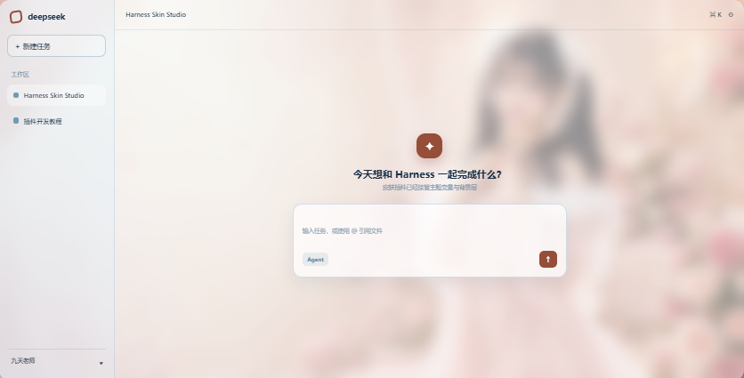
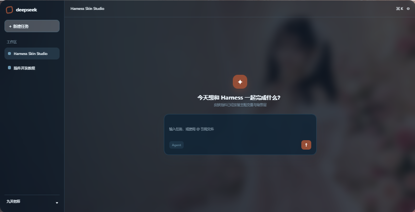
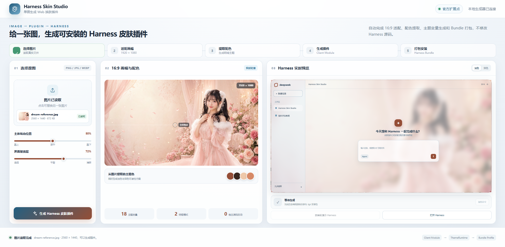
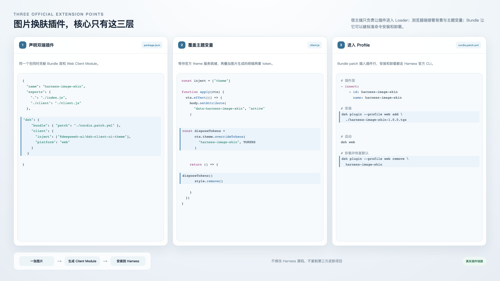

<p align="center">
  <a href="./.github/assets/readme/demo.mp4">
    
  </a>
</p>

<h1 align="center">DeepSeek Harness Plugin Image Skin</h1>

<p align="center">
  <strong>给一张图片，生成一个可安装、可卸载、自动适配明暗模式的 DeepSeek Harness Web 皮肤插件。</strong>
</p>

<p align="center">
  <a href="./.github/assets/readme/demo.mp4"><strong>▶ 查看 1 分钟真实演示</strong></a>
</p>

<p align="center">
  
  
  <a href="./LICENSE"></a>
  
</p>

> [!IMPORTANT]
> 不是 DeepSeek 官方项目，也不代表官方认可或合作。项目基于 DeepSeek Harness 公开的 Bundle、Client Module、ThemeRuntime 与 Profile 扩展点实现，不修改 Harness 源码。
>
> 本仓库参考了 [fufankeji/deepseek-harness-plugin-image-skin](https://github.com/fufankeji/deepseek-harness-plugin-image-skin)，感谢原项目提供的设计与实现参考。

## 效果

<table>
  <tr>
    <td width="50%">
      
      <br /><strong>浅色模式</strong><br />背景、侧栏、输入区、边框和品牌色同时生效。
    </td>
    <td width="50%">
      
      <br /><strong>深色模式</strong><br />同一插件跟随 Harness Appearance 自动切换深色 Token。
    </td>
  </tr>
</table>

<p align="center">
  
</p>

## 它做了什么

- 在浏览器本地读取 PNG、JPG 或 WebP，不上传原图；
- 使用 Canvas 按 cover 规则生成 1920 × 1080 WebP；
- 从图片像素提取主题色，并生成 Light / Dark 两套 Token；
- 生成 Harness Client Module、ThemeRuntime 覆盖和卸载清理逻辑；
- 创建 Bundle patch、追溯信息与 MIT License；
- 真实执行 `npm pack`，输出可由 `dsh plugin add` 安装的 `.tgz`。

## 快速开始

要求：

- Node.js 22.19.0 或更高版本；
- 已安装可用的 DeepSeek Harness `dsh` CLI；
- Chromium、Chrome 或其他现代浏览器。

```bash
git clone https://github.com/Lesterffx/deepseek-harness-plugin-image-skin.git
cd deepseek-harness-plugin-image-skin
npm start
```

打开 <http://127.0.0.1:4173>：

1. 选择一张图片；
2. 调整主体纵向位置和玻璃层强度；
3. 点击“生成插件”；
4. 在 `output/` 中取得源码目录和 `.tgz` 安装包。

安装生成的插件：

```bash
dsh plugin --profile web add ./output/harness-image-skin-1.0.0.tgz
dsh web
```

如果执行安装命令时，当前工作目录与插件项目目录不同，可以将相对路径替换为插件包的完整路径。Windows PowerShell 示例：

```powershell
npx @deepseek-ai/dsh plugin --profile web add "D:\path\to\deepseek-harness-plugin-image-skin\output\harness-image-skin-1.0.0.tgz"
```

> [!NOTE]
> - `D:\path\to\deepseek-harness-plugin-image-skin` 是经过隐私处理的示例路径，请替换为你本机的实际项目目录。
> - 完整路径必须指向生成后的 `.tgz` 文件，而不是只指向 `output` 目录。
> - 路径包含空格或中文时，应保留路径两侧的双引号；在公开 Issue、日志或截图中，请隐藏真实用户名和本机目录结构。

卸载：

```bash
dsh plugin --profile web remove harness-image-skin
```

## 工作方式

<p align="center">
  
</p>

```text
本地图片
  → Canvas 1920×1080 WebP
  → 主题配色与 Light / Dark Tokens
  → Client Module + ThemeRuntime
  → Bundle patch + npm pack
  → harness-image-skin-1.0.0.tgz
  → DeepSeek Harness Web profile
```

生成出的插件包含：

```text
harness-image-skin/
├── assets/background.webp
├── client.js
├── cordis.patch.yml
├── generation.json
├── index.js
├── package.json
├── README.md
└── LICENSE
```

`examples/generated-plugin/` 保留了一份由示例猫咪图片真实生成的插件源码，方便直接查看最终结构。

## 版本边界

本项目在以下环境完成真实生成、安装、浅色显示、深色切换与卸载恢复：

- DeepSeek Harness CLI `0.1.0-rc.6`；
- DeepSeek Harness 官方仓库提交 `47f943859bef60e4160492346772ded9b24f765a`；
- Node.js `24.16.0`。

DeepSeek Harness 当前仍处于 Developer Preview，后续版本可能调整插件接口。相关一手来源：

- [插件开发基础](https://github.com/deepseek-ai/deepseek-harness/blob/47f943859bef60e4160492346772ded9b24f765a/docs/user/develop/basic/index.zh.md)
- [Bundle 打包与安装](https://github.com/deepseek-ai/deepseek-harness/blob/47f943859bef60e4160492346772ded9b24f765a/docs/user/develop/basic/publish.zh.md)
- [Client Modules](https://github.com/deepseek-ai/deepseek-harness/blob/47f943859bef60e4160492346772ded9b24f765a/docs/subsystems/client-modules.md)
- [ThemeRuntime 源码](https://github.com/deepseek-ai/deepseek-harness/blob/47f943859bef60e4160492346772ded9b24f765a/packages/client/ui-theme/src/client/index.ts)

## 项目结构

```text
deepseek-harness-plugin-image-skin/
├── .github/assets/readme/  # README 图片和演示视频
├── examples/               # 示例图片与真实生成插件
├── public/                 # Skin Studio 前端
├── server.mjs              # 本地服务、源码生成、打包和可选安装
├── package.json
└── LICENSE
```
